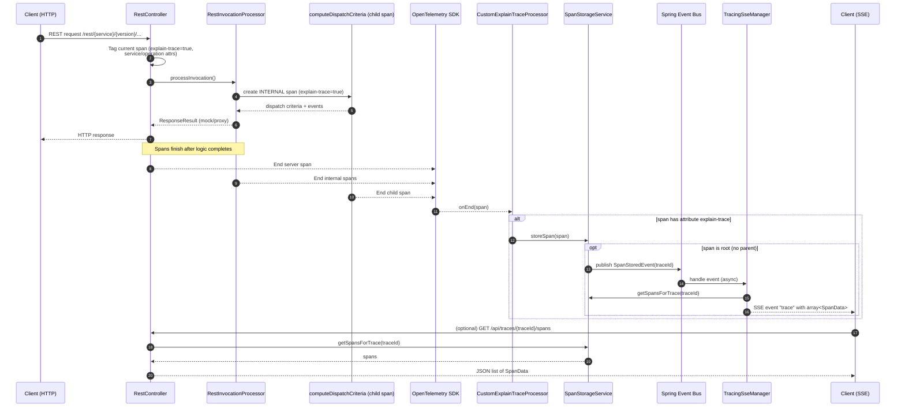

# Real-time Span Streaming with Server-Sent Events

## Overview

The TracingController now provides a real-time streaming endpoint for OpenTelemetry spans using Server-Sent Events (SSE) and Spring's event system. This allows clients to receive new span data in real-time as it becomes available, without the need for polling.

## Endpoint

```
GET /api/traces/operations/spans/stream?serviceName={service}&operationName={operation}
```

### Parameters

- `serviceName` (required): The name of the service to filter spans by
- `operationName` (required): The name of the operation to filter spans by

### Response

The endpoint returns a `text/event-stream` that sends JSON data for new spans matching the specified service and operation criteria.

## Architecture

### Event-Driven Approach

The implementation uses Spring's event system instead of polling:

1. **SpanStoredEvent**: Published whenever a new span is stored in `SpanStorageService`
2. **Event Listener**: `TracingController.handleSpanStoredEvent()` listens for these events
3. **Real-time Filtering**: Events are filtered and sent to relevant SSE subscribers immediately

### Components

#### SpanStoredEvent
- Custom Spring ApplicationEvent containing the stored span and trace ID
- Published by `SpanStorageService.storeSpan()`

#### TracingController
- Manages SSE subscriptions via an internal `SseSubscription` class
- Listens for `SpanStoredEvent` and forwards matching spans to subscribers
- Handles client lifecycle (connection, timeout, errors)

#### SpanStorageService
- Modified to publish `SpanStoredEvent` when storing spans
- Uses `ApplicationEventPublisher` for event publishing

## Component Architecture Overview

The following diagram shows the static component relationships and primary data/event flows involved in the `explain-trace` and SSE streaming feature.

```mermaid
flowchart LR
    subgraph A[Mock Invocation Path]
      HTTPClient[Client\n(REST caller)] --> RC[RestController]
      RC --> RIP[RestInvocationProcessor]
      RIP --> OTel[OpenTelemetry SDK\n(auto & manual spans)]
    end

    OTel --> CP[CustomExplainTraceProcessor\n(SpanProcessor)]
    CP -->|store spans with attribute `explain-trace`| SS[SpanStorageService\n(in-memory, capped)]
    SS -->|root span end -> publish| EB[(Spring Event Bus)\nSpanStoredEvent]
    EB --> SSEMgr[TracingSseManager\n(subscription registry)]
    SSEMgr -->|SSE event name: `trace`\narray<SpanData>| SSEClient[Client\n(SSE subscriber)]

    SSEClient -->|optional REST lookup| RC
    SS -. capacity policy .- SS

    classDef comp fill:#0d5aa7,stroke:#0b437c,stroke-width:1,color:#fff;
    classDef store fill:#136f63,stroke:#0b5249,stroke-width:1,color:#fff;
    classDef event fill:#8a2be2,stroke:#5d1d99,stroke-width:1,color:#fff;
    class RC,RIP,CP,SSEMgr comp;
    class SS store;
    class EB event;
```

### Responsibilities
| Component | Role |
|-----------|------|
| RestController | Tags top-level span, resolves service/operation, invokes processing, exposes REST retrieval endpoints |
| RestInvocationProcessor | Creates child/internal spans, adds detailed events & attributes, dispatch logic |
| OpenTelemetry SDK | Lifecycle & context for spans, invokes registered SpanProcessor(s) on end |
| CustomExplainTraceProcessor | Filters finished spans for presence of `explain-trace` attribute and forwards them for storage |
| SpanStorageService | In-memory retention (1000 traces / 100 spans per trace), publishes event on root span arrival |
| Spring Event Bus | Asynchronous decoupling of storage from streaming layer via `SpanStoredEvent` |
| TracingSseManager | Manages subscriptions (serviceName+operationName keys), pushes full trace snapshot upon root span completion, heartbeat maintenance |
| SSE Client | Receives `trace` events (array of SpanData), may also query REST endpoints for historical retrieval |

### Data / Control Flow Highlights
1. REST request produces server span; components tag it (`explain-trace=true`).
2. Internal logic creates additional spans (also tagged) with rich events.
3. On span end, processor inspects attributes; qualifying spans added to per-trace buffer.
4. First root span end for a trace (or finalization) triggers `SpanStoredEvent` → streaming notification.
5. SSE manager fetches entire trace snapshot (current spans list) and emits one `trace` event (atomic view).
6. Capacity enforcement silently evicts oldest traces/spans; clients wanting durability must export early.

### Extension Points
* Add incremental per-span push: emit events earlier (before root completion) for near real-time partial views.
* Persist traces (e.g., to a time-series DB) on eviction or asynchronously for long-term analytics.
* Enhance filtering: allow attribute-based subscription patterns (wildcards / regex) beyond service & operation.
* Security: introduce auth guard on `/api/traces/**` + SSE endpoint (e.g., token or API key).

### Operational Considerations
* Memory Footprint: O(traces * spansPerTrace) bounded by configuration constants; adjust if higher concurrency needed.
* Backpressure: Current design sends full trace array each time; for very large traces consider delta or pagination.
* Ordering: Spans in emitted array reflect insertion order; consumers may sort by start/end timestamps for visualization.
* Idempotence: Re-emission currently occurs only once per trace (root span trigger). If replays are needed, persist and add `replay` mode.


## Usage Example

### JavaScript Client

```javascript
const eventSource = new EventSource('/api/traces/operations/spans/stream?serviceName=my-service&operationName=my-operation');

// Server emits events named "trace" that contain an array of SpanData for the full trace.
eventSource.addEventListener('trace', function(event) {
  const spans = JSON.parse(event.data); // spans is an array
  console.log('Trace update with', spans.length, 'spans');
});

eventSource.addEventListener('heartbeat', () => {
  // Optional: keep-alive signal
});

eventSource.addEventListener('error', function(event) {
  console.error('SSE error:', event);
});

// To close later: eventSource.close();
```

### curl Example

```bash
curl -N -H "Accept: text/event-stream" \
  "http://localhost:8080/api/traces/operations/spans/stream?serviceName=my-service&operationName=my-operation"
```

## Benefits

1. **Real-time Updates**: No polling delay - spans are sent immediately when available
2. **Efficient**: Event-driven approach reduces CPU usage compared to polling
3. **Scalable**: Spring's async event handling supports multiple concurrent subscribers
4. **Resource Management**: Automatic cleanup of subscriptions on client disconnect

## Configuration

The SSE connections have a 30-minute timeout by default. This can be adjusted in the controller if needed.

## Error Handling

- Client disconnections are automatically detected and cleaned up
- SSE errors complete the stream and remove the subscription
- Timeouts automatically clean up resources

## Comparison with Original Endpoint

| Aspect | Original `/operations/spans` | New `/operations/spans/stream` |
|--------|------------------------------|--------------------------------|
| Method | Request/Response | Server-Sent Events |
| Data | All historical spans (batched) | Newly completed traces (root span ended) |
| Updates | Manual refresh required | Automatic push (event name: `trace`) |
| Resource Usage | Higher (repeated queries) | Lower (event-driven) |
| Use Case | One-time / retrospective analysis | Real-time monitoring & live explain view |

## Mermaid Sequence Diagram

The diagram below summarizes the lifecycle of an `explain-trace` flow from incoming HTTP request to client streaming:



### Key Points Visualized
* All relevant spans explicitly get `explain-trace=true`.
* Only root span completion triggers a `SpanStoredEvent` → one SSE push per completed trace.
* Streaming event name is `trace` (array of spans), not individual span events.
* REST endpoints remain available for retrospective retrieval.

### Possible Extensions
* Emit incremental span events (e.g. `span`) before root completion if near-real-time granularity is desired.
* Add persistence or export hook when eviction thresholds are reached.

