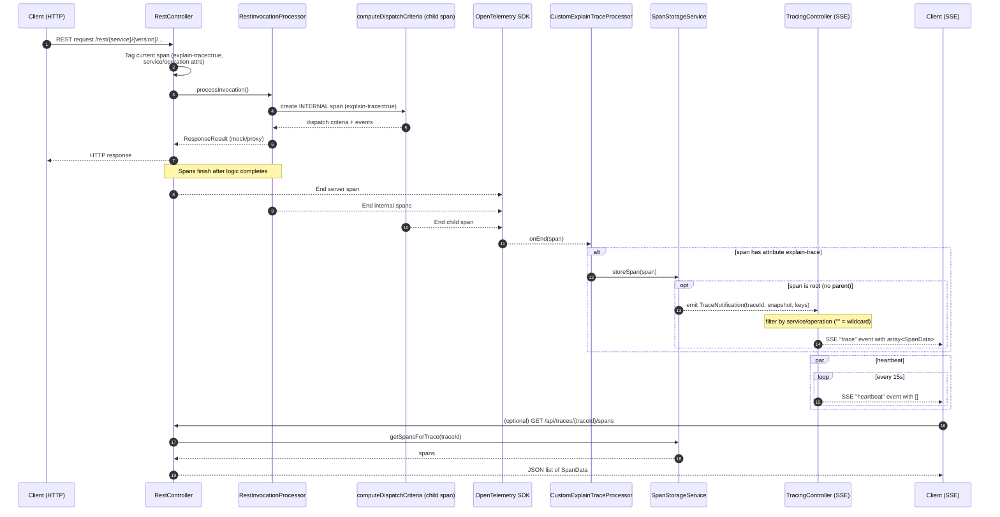

# Real-time Span Streaming with Server-Sent Events

## Overview

The TracingController provides a real-time streaming endpoint for OpenTelemetry spans using Server-Sent Events (SSE)
built on Spring WebFlux. Clients receive completed trace snapshots in real time from a reactive stream exposed by
`SpanStorageService`, without polling.

## Endpoint

```
GET /api/traces/operations/spans/stream?serviceName={service}&operationName={operation}
```

1. `SpanStorageService` emits a `TraceNotification` on root span completion containing:
  - the `traceId`
  - a snapshot `List<SpanData>` of the whole trace
  - routing keys: `{serviceName, operationName}` pairs extracted from spans
2. `TracingController` consumes this Flux, filters notifications by `serviceName`/`operationName` (supports empty values
   as wildcards), and maps them to SSE `trace` events.
3. The controller merges a periodic heartbeat into the stream to keep connections alive.

### Components

#### TracingController


#### SpanStorageService


#### OpenTelemetry SDK and CustomExplainTraceProcessor


#### SSE Client


## Component Architecture Overview

The diagram shows the relationships and data flow for `explain-trace` and SSE streaming.

```mermaid
flowchart LR
subgraph A[Mock Invocation Path]
HTTPClient[Client\nREST caller] --> RC[RestController]
RC --> RIP[RestInvocationProcessor]
RIP --> OTel[OpenTelemetry SDK\nauto & manual spans]
end

OTel --> CP[CustomExplainTraceProcessor\nSpanProcessor]
CP -->|store spans with attribute `explain -trace`|SS[SpanStorageService\nin-memory, capped]
SS -->|Flux<TraceNotification>\n  root span end | TCtrl[TracingController\nWebFlux SSE]
TCtrl -->|SSE `trace`\narray<SpanData>|SSEClient[Client\nSSE subscriber]

SSEClient -->|optional REST lookup| RC

classDef comp fill:#0d5aa7,stroke:#0b437c,stroke - width:1,color:#fff ;
classDef store fill:#136f63,stroke:#0b5249,stroke - width:1,color:#fff ;
class RC,RIP,CP,TCtrl comp ;
class SS store ;
```

### Responsibilities

| Component                   | Role                                                                                                   |
|-----------------------------|--------------------------------------------------------------------------------------------------------|
| RestController              | Tags top-level span, resolves service/operation, invokes processing, exposes REST retrieval endpoints  |
| RestInvocationProcessor     | Creates child/internal spans, adds detailed events & attributes, dispatch logic                        |
| OpenTelemetry SDK           | Lifecycle & context for spans, invokes registered SpanProcessor(s) on end                              |
| CustomExplainTraceProcessor | Filters finished spans for presence of `explain-trace` attribute and stores them                       |
| SpanStorageService          | In-memory retention with caps; emits Flux<TraceNotification> on root span completion (snapshot + keys) |
| TracingController           | WebFlux SSE endpoint that filters notifications by service/operation and emits `trace` + `heartbeat`   |
| SSE Client                  | Receives `trace` events (array of SpanData) and `heartbeat`, can query REST endpoints for history      |

### Data / Control Flow Highlights

1. REST request produces server span; components tag it (`explain-trace=true`).
2. Internal logic creates additional spans (also tagged) with rich events.
3. On span end, processor inspects attributes; qualifying spans added to per-trace buffer.
4. First root span end for a trace triggers a `TraceNotification` on the reactive stream.
5. TracingController filters by service/operation and emits one SSE `trace` event with the snapshot (atomic view).
6. Capacity enforcement silently evicts oldest traces/spans; clients wanting durability must export early.

### Extension Points

* Emit incremental per-span events before root completion for near real-time partial views.
* Persist traces (e.g., to a time-series DB) on eviction or asynchronously for long-term analytics.
* Support richer filters (regex/attributes) atop the Flux before mapping to SSE.
* Security: introduce auth guard on `/api/traces/**` + SSE endpoint (e.g., token or API key).

### Operational Considerations

* Memory Footprint: O(traces * spansPerTrace) bounded by configuration constants; adjust if higher concurrency needed.
* Backpressure: Current design sends full trace array each time; for very large traces consider delta or pagination.
* Ordering: Spans in emitted array reflect insertion order; consumers may sort by start/end timestamps for
  visualization.
* Idempotence: Re-emission currently occurs only once per trace (root span trigger). If replays are needed, persist and
  add `replay` mode.

## Usage Example

### JavaScript Client

```javascript
const eventSource = new EventSource('/api/traces/operations/spans/stream?serviceName=my-service&operationName=my-operation');

// Server emits events named "trace" that contain an array of SpanData for the full trace.
eventSource.addEventListener('trace', function (event) {
  const spans = JSON.parse(event.data); // spans is an array
  console.log('Trace update with', spans.length, 'spans');
});

eventSource.addEventListener('heartbeat', () => {
  // Optional: keep-alive signal
});

eventSource.addEventListener('error', function (event) {
  console.error('SSE error:', event);
});

// To close later: eventSource.close();
```

### curl Example

```bash
curl -N -H "Accept: text/event-stream" \
  "http://localhost:8080/api/traces/operations/spans/stream?serviceName=my-service&operationName=my-operation"
```

## Benefits

1. **Real-time Updates**: No polling delay - snapshots are pushed on root span completion
2. **Efficient**: Reactive pipeline avoids blocking threads and re-fetching snapshots
3. **Scalable**: Reactor backpressure and multicast support many concurrent subscribers
4. **Robust**: Periodic heartbeats keep connections alive and simplify client timeouts

## Configuration

Heartbeats are emitted ~every 15 seconds from the controller. Adjust the interval in `TracingController` if needed.


## Mermaid Sequence Diagram

The diagram below summarizes the lifecycle from incoming HTTP request to client streaming using the reactive path:




